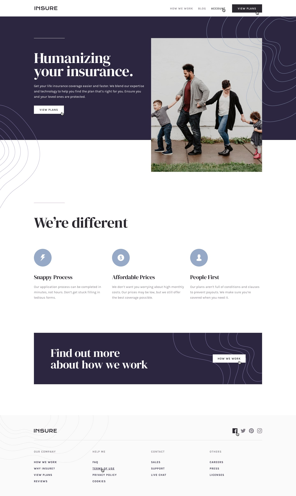
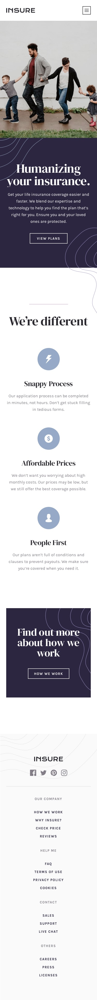

# Frontend Mentor - Insure Landing Page

This is a solution to the [Insure Landing Page challenge on frontend Mentor](https://www.frontendmentor.io/challenges/insure-landing-page-uTU68JV8). Frontend Mentor challenges help you improve your coding skills by building realistic projects. 

## Table of contents

  - [Overview](#overview)
  - [The challenge](#the-challenge)
  - [Screenshot](#screenshot)
  - [Links](#links)
  - [My process](#my-process)
  - [Built with](#built-with)
  - [What I learned](#what-i-learned)
  - [Continued development](#continued-development)
  - [Useful resources](#useful-resources)
  - [Author](#author)
  - [Acknowledgments](#acknowledgments)

## Overview

### Screenshot

## **Desktop Mode**

## **Active States**

## **Mobile Mode**

### Links

- Solution URL: [Solution URL](https://github.com/Shakirullah25/Insure-Landing-Page.git)
- Live Site URL: [Live Demo](https://shakirullah25.github.io/Insure-Landing-Page/)

## My process

### Built with

- Flutter for the frontend development
- Flutter Web for deployment
- Google Fonts Package for typography
- Flutter Widgets for UI components
- [Flutter](https://flutter.dev/) - Flutter official site

### What I Learned 📚

Building this project was a challenging yet rewarding experience. I gained deeper insights into:
✅ Responsive Design – Adapting layouts for different screen sizes
✅ Design Guidelines – Implementing structured UI/UX principles
✅ Flutter Web Deployment – Hosting a Flutter app on GitHub Pages

I'm grateful for the successful completion of this challenge and the opportunity to improve my skills.

### Continued Development 🚀
Going forward, I aim to:
🔹 Master responsive UI techniques for web and mobile

Final Thoughts
This project was an exciting journey, and I look forward to applying these learnings in future projects! 🎯

### Useful resources

Are you getting started with Flutter? Begin your journey with the official documentation:[Flutter Official Website](https://flutter.dev/)

## Author

- Website - [Shakirullah](https://shakirullah25.github.io/Insure-Landing-Page/)
- Frontend Mentor - [@Shakirullah25](https://www.frontendmentor.io/home)
- Twitter (X) - [@Shakirullah25](https://x.com/Shakirullah25?t=pt3PNo8P7PSy3RaDbzCRHQ&s=09)
- Instagram - [@Shakirullah_001](https://www.instagram.com/shakirullah_001/profilecard/?igsh=MXBpcW9qeGFvcjVvaQ==)

## Acknowledgments

A huge thank you to [Frontend Mentor](https://www.frontendmentor.io/home)for providing such an amazing platform to practice and improve frontend development skills! 🎯 

